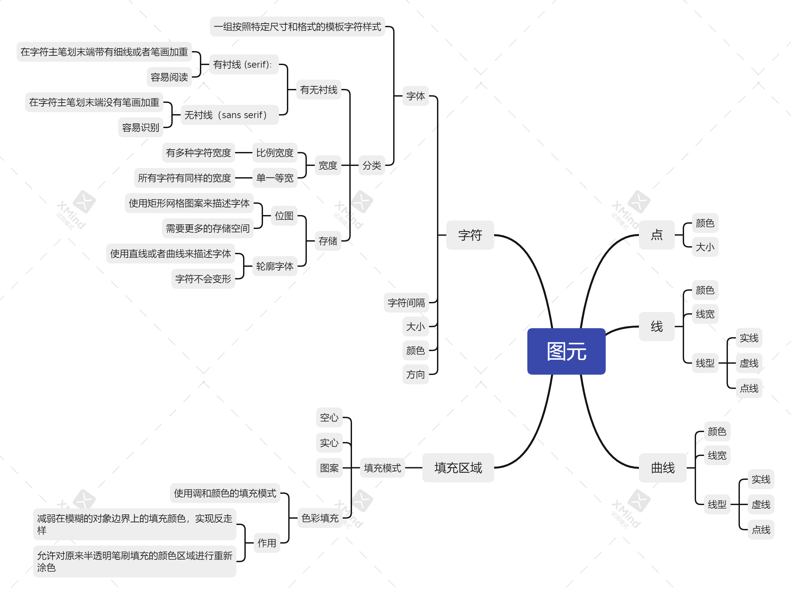

计算机图形学_第四章_2021-10-18 14:30:00 

## 名词解释

计算机图形应用编程接口[CG API]: 用于图形应用的通用软件包
图元（图形输出原语）: 图形软件包中用来描述各种图形元素的函数
几何图元：描述几何要素的输入图元
图形对象(标准图形对象)：使用一组多边形面皮描述的对象
多边形： 在数学上定义为由3个或者更多的顶点坐标位置描述的平面图形
凸多边形：一个多边形的所有内角均小于180，则该多边形凸多边形
凹多边形：不是凸边形的多边形
退化多边形：用来描述共线或者重叠坐标位置的顶点集 
后向面： 向着对象内部的一侧称为后向面
前向面：可见或者朝外的一侧称为前向面

### 识别凹多边形
1. 凹多边形某些边的延长线会与其他边相交且有时一对内点之间的连线会与多边形边界相交
2. 如果为每一条边建立一个向量，则可使用相邻边的交叉积来测试，凸多边形的所有**向量叉积**同号
3. 对多边的顶点位置与每条边延长线的关系，如果有些顶点在某一边延长线的一侧而其他一些顶点在另一侧， 则该多边形式凹多边形

### 向量叉积

> 是一种在向量空间中向量的二元运算。与点积不同，它的运算结果是一个伪向量而不是一个标量。并且两个向量的叉积与这两个向量和垂直

> 向量**a**和向量**b**的乘积： **a** x **b** 

#### 模长

> |**a** x **b** | =|**a**| x |**b** | * sinθ (θ两向量之间的夹角（共起点的前提下）（0°≤θ≤180°）)

### 坐标运算

设 a = (ax,ay, az ), b= (bx,by, bz )。**i**，**j**，**k**分别是X，Y，Z轴方向的单位向量

**a**×**b**=（aybz - byaz）i+（azbx - bzax）j+（axby - bxay）k

### 内外测试[点在内部区域还是外部区域]

#### 奇偶原则

> 从任意位置**P**到对象范围以外的远点画一条概念上的射线，并统计该射线与各边的交点个数，当个数为奇数为内部点，否则为外部点,为了得到精确的相交边数，必须确认所画的直线不与任何多边形的顶点相交。

#### 非零环绕数

> 多边形以逆时针方向环绕某一特定点的次数称为环绕数

> 设想从任意位置**P**到对象坐标范围外的远处画一条射线，所选择的射线不能与多边形的任何顶点相交，当从**P**点沿射线方向移动是，统计穿过该射线的边的方向，每当多边形从右到左穿过射线时，边数加1，否则减1， 在所有穿过的边数统计完成后，环绕数的最终值决定了**P**的相对位置，非零为内部点否则为外部点。

计算机图形学_第五章_2021-10-18 15:10:00

## 名词解释

属性参数：任何影响图元显示方法的参数
状态系统：维护属性或者其他参数的当前值表的图形系统也被称为状态机
状态变量：输出图元的属性和当前帧缓存位置等其他参数称为状态变量或者状态参数
颜色调和函数： 多种颜色调和效果的方法也叫图像混合方法

计算机图形学_第六章_2021-10-18 15:10:00

## 名词解释

